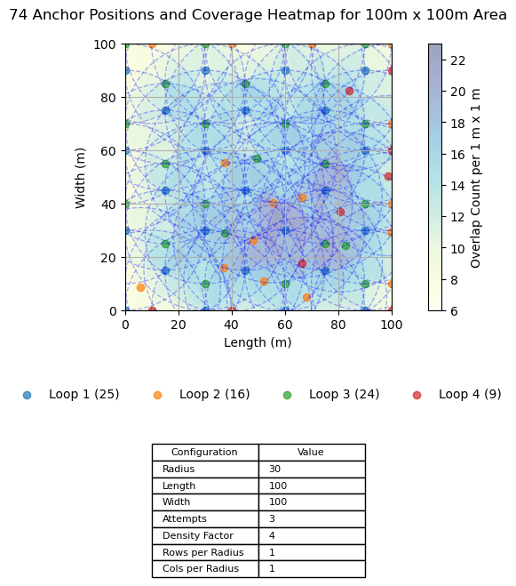

# Anchor Placement & Simulation Tool

## Overview
This tool automates the placement of anchors (e.g., BLE beacons) within a rectangular area, evaluates signal coverage density, and outputs configuration files and diagnostics for indoor location system planning and simulation.

It uses multiple placement passes (called **loops**) to maximize coverage. Each anchor is tagged with its loop of origin and color-coded in the plot for visibility and debugging.

---

## Inputs

### `coverage_density.json`
Defines spatial and tiling parameters.

#### Example:
```json
{
  "radius": 30,
  "length": 100,
  "width": 100,
  "attempts": 30,
  "density_factor": 4,
  "rows_per_radius": 2,
  "cols_per_radius": 2
}
```

#### Parameters:
- **radius**: Signal range of each anchor in meters.
- **length / width**: Dimensions of the rectangular coverage area in meters.
- **attempts**: Number of random placement retries if a proposed anchor is too close to another.
- **density_factor**: Controls minimum spacing between anchors (`radius / density_factor`).
- **rows_per_radius**: Controls horizontal anchor grid density (`row_distance = radius / rows_per_radius`).
- **cols_per_radius**: Controls vertical anchor grid density (`col_distance = radius / cols_per_radius`).

> ⚠️ **Note**: If the area is too small relative to the radius, density tuning may have limited effect.

---

### `config.json`
Defines simulation and radio characteristics.

#### Key sections:
- **tag_path**: Walking path of a simulated tag.
- **device_profile**: Radio characteristics of the tag device (e.g. iPhone).
- **environment**: Propagation environment (path loss exponent, body attenuation).

#### Example:
```
{
  "tag_path": {
    "from_anchor_id": 1,
    "to_anchor_id": 2,
    "height_cm": 183,
    "mode": "steady_walk"
  },
  "device_profile": {
    "name": "iPhone",
    "P0": -49
  },
  "environment": {
    "path_loss_exponent": 2.0,
    "body_attenuation_dB": 6.0
  }
}
```
---

### `config_{timestamp}.json`
- `anchors`: List of generated anchor positions with `x`, `y`, `id`, and `loop_id`.
- `tiling_config`: Echo of all input parameters.
- `plot_file` / `log_file`: References to the output files.
- `coverage_stats`: Cumulative coverage percentages (per m²).

#### Snippet:
```{
  "tag_path": {
    "from_anchor_id": 1,
    "to_anchor_id": 2,
    "height_cm": 183,
    "mode": "steady_walk"
  },
  "device_profile": {
    "name": "iPhone",
    "P0": -49
  },
  "environment": {
    "path_loss_exponent": 2.0,
    "body_attenuation_dB": 6.0
  },
  "anchors": [
    {
      "id": 1,
      "x": "0.00",
      "y": "0.00",
      "loop_id": 1
    },
    {
      "id": 2,
      "x": "15.00",
      "y": "15.00",
      "loop_id": 1
    },
    {
      "id": 3,
      "x": "30.00",
      "y": "0.00",
      "loop_id": 1
    },
    : 
    {
      "id": 74,
      "x": "98.86",
      "y": "50.48",
      "loop_id": 4
    }
  ],
  "tiling_config": {
    "radius": 30,
    "length": 100,
    "width": 100,
    "attempts": 3,
    "density_factor": 4,
    "rows_per_radius": 1,
    "cols_per_radius": 1,
    "coverage_stats": {
      "0": 0.0,
      "1": 0.0,
      "2": 0.0,
      "3": 0.0,
      "4": 0.0,
      "5": 0.0,
      "6": 0.19,
      "7": 0.73,
      "8": 3.36,
      "9": 2.81,
      "10": 6.62,
      "11": 7.95,
      "12": 9.14,
      "13": 9.67,
      "14": 12.82,
      "15": 13.04,
      "16": 10.26,
      "17": 8.92,
      "18": 5.44,
      "19": 4.36,
      "20": 3.07,
      "21": 1.19,
      "22": 0.4,
      "23": 0.03
    },
    "plot_file": "plot_20250328_113227.png",
    "log_file": "config_20250328_113227.log"
  }
}
```

### `plot_{timestamp}.png`
A rendered plot showing:
- Colored dots for anchor positions, grouped by loop
- Blue dashed circles showing coverage area per anchor
- Background heatmap of overlap intensity
- Table of input configuration
- Legend below indicating loop origin



### `config_{timestamp}.log`
- Detailed log of placements
- Violations (too close)
- Fallback attempts
- Coverage stats

### `config_{timestamp}.log`
Contains:
- Detailed log of anchor placement
- Violations (e.g. too-close anchors)
- Fallback attempts
- Coverage stats (raw and cumulative)

📄 [View sample log](examples/config_log_example.log)

---

## Tiling Strategy: Multi-Loop Coverage

The anchor placement algorithm performs four grid sweeps (called loops) with different biases to avoid blind spots and ensure uniform density:

| Loop | Direction               | Offset Logic                     | Purpose                                    |
|------|-------------------------|----------------------------------|--------------------------------------------|
| 1    | Top→Bottom, Left→Right  | Even rows offset (hex grid)      | Main sweep with hex-like symmetry          |
| 2    | Bottom→Top, Right→Left  | Odd rows offset                  | Alternate sweep to fill skipped gaps       |
| 3    | Bottom→Top, Left→Right  | Even rows, opposite corner offset| Reinforcement sweep for symmetry           |
| 4    | Top→Bottom, Right→Left  | Odd rows offset                  | Final sweep to fill remaining gaps         |

If a proposed anchor is too close to an existing one, the tool will attempt up to `attempts` random fallback placements.

Each anchor is tagged with its `loop_id`, and the plot colors reflect which loop placed it.

---

## Coverage Metrics
Coverage is computed at 1m² resolution. Each cell records how many anchors cover it.

The tool outputs a **cumulative coverage histogram**, showing what percentage of the area is covered by at least `n` anchors:

#### Example:
```
📊 Coverage Stats (per 1m² cell, cumulative):
  Covered by 8 anchor(s): 100.00%
  Covered by 7 anchor(s): 100.00%
  ...
```

This helps assess redundancy and area coverage quality.

---

## Usage

1. Edit `coverage_density.json` and `config.json` with your parameters.
2. Run the tool:

```bash
python tiling.py
```

3. Review the generated files:
   - `plot_*.png`: Visual output
   - `config_*.json`: Anchor + environment config
   - `config_*.log`: Diagnostic logs

---

## 🐳 Docker Support (No Python setup required)

You can run the tool inside Docker for portability:

### 1. Build:
```bash
docker build -t anchor-tiling-tool .
```

### 2. Run:
```bash
docker run --rm -v $(pwd):/app anchor-tiling-tool
```

Ensure `coverage_density.json` and `config.json` exist in your working directory.

---

## License
MIT or similar license placeholder.

---

## Author
Bryan O'Brien / Personal Projects